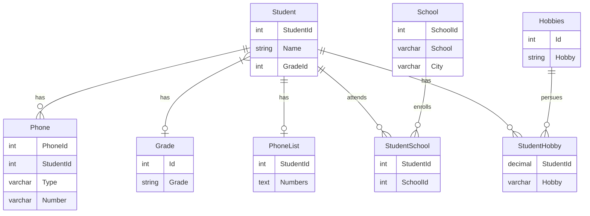

# db2022

### Beskrivning

Slutprojekt i kursen DB2022. I detta projekt kommer ska eleven redovisa inom SQL,normalisering samt Java(jdbc) mot en databas.

---

#### Dokumentation

Nedan är ett ER-diagram på UNF-databasen när den har normaliserats.
Diagramet är byggt med [Mermaid](https://mermaid.js.org/syntax/entityRelationshipDiagram.html)

---

##### Förklaring

