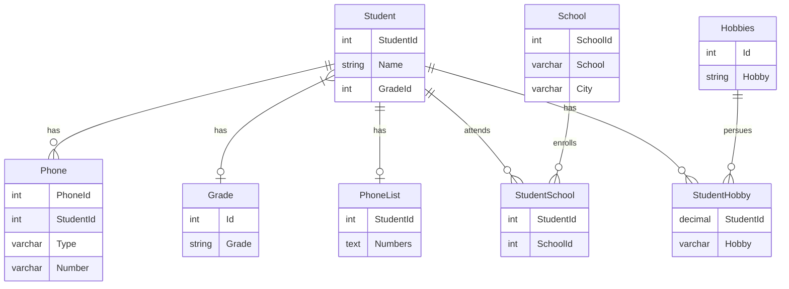

# db2022


### Beskrivning


Slutprojekt i kursen DB2022. I detta projekt kommer ska eleven redovisa inom SQL,normalisering samt Java(jdbc) mot en databas.


För att följa instruktionerna nedan krävs följande applikationer:
- [Docker Desktop](https://www.docker.com/products/docker-desktop/)
- [Gradle](https://gradle.org/)
- [Git](https://git-scm.com/)


---


#### Dokumentation

Nedan är ett ER-diagram på UNF-databasen när den har normaliserats.
Diagramet är byggt med [Mermaid](https://mermaid.js.org/syntax/entityRelationshipDiagram.html)





---

##### Förklaring


#### Instruktioner

klona detta projekt till önskad mapp.

```bash

git clone https://github.com/selim-kose/db2022

```

Starta en image av databesen MySQL

```bash

docker run -d --name iths-mysql\
	 -e MYSQL_ROOT_USERNAME=root\
	 -e MYSQL_ROOT_PASSWORD=root\
	 -e MYSQL_USER=iths\
	 -e MYSQL_PASSWORD=iths\
	 -e MYSQL_DATABASE=iths\
	 -p 3306:3306\
	 -d mysql/mysql-server:latest


```

Kopiera csv filen som innehåller data som vi kommer att normalisera. Den plaseras i din MySQL image

```bash

docker cp denormalized-data.csv iths-mysql:/var/lib/mysql-files

```

Kör SQL scriptfilen som för skapar en databas av csv filen ovan och sedan normailserar den.

```bash

docker exec -i iths-mysql mysql -uroot -proot < normal.sql

```

starta java projektet

```bash

gradle run

```


